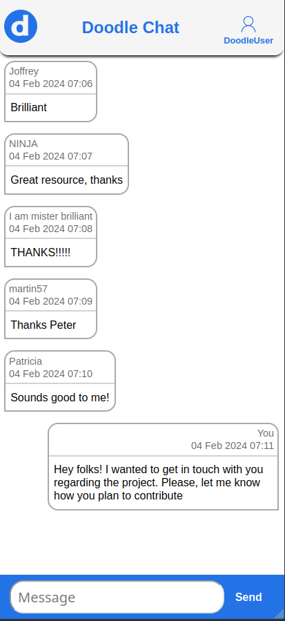

# DoodleChat

---

### Submission for [CHALLENGE.md](./CHALLENGE.md)

---

### Running
Ensure ports 8888 (for backend) and 3000 (for frontend) 
aren't already in use. Else, modify docker-compose.yml accordingly
to use another port.

```shell
$ git clone --depth 1 https://github.com/seanick39/doodlechat.git
$ cd doodlechat
$ docker compose up
```

Open http://localhost:3000 in browser.

---

### Docker compose orchestration
#### Database
- Compose service `db`
- Postgres 15 image
- Exposes port 5432 on the internal network.
- Doesn't use volume mounts. Data will not persist after container is destroyed.


#### Backend
- Compose service `backend`
- Builds and runs a Spring Boot jar
- Exposes port 8888 to host, needed by browser


#### Frontend
- Compose service `frontend`
- Copies the frontend/src directory, and runs `npm run start`.
- Exposes port 3000 to host.

---

### Approach
Instead of using websockets for bi-directional communication of messages,
the approach of polling for new messages has been used. The API endpoint
to list all messages accepts request parameter `afterMessageId`, where if 
a valid UUID of existing message is provided, all later messages will
be sent as response.
The frontend keeps checking after a short interval for new messages.


### Screenshot

